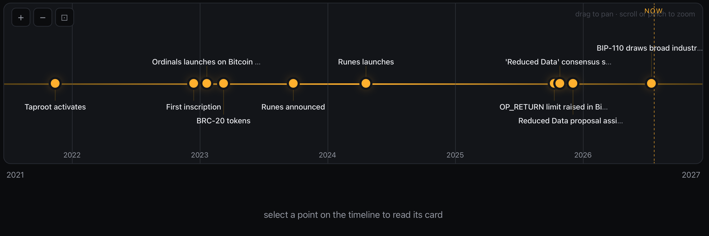

# Wiki-Timechain

A live viewer for nostr kind-30818 wiki cards, rendered on a proportional
timeline. Reads straight from relays — no server, no login, no build step.
Any dated event with a source link fits naturally on the rail.

**Live:** https://lamekarjeggr.github.io/Wiki-Timechain/



## What it does

Timelines are discovered automatically, not hardcoded — the viewer pulls
30818 events from relays and groups any that carry a date and a collection
tag into tabs. Add a new card to a new collection and it just shows up —
no fixed list, no publish-side registration.

## Navigating

Pan by dragging, zoom with the wheel or pinch, click a node to open its card.

## The convention

A card needs, at minimum:
- a **collection tag** — a kebab-case slug shared by every card in the
  same timeline
- an **event date** (`YYYY-MM-DD`) — this is what places it on the rail;
  no date means no discovery
- a **title** and a one-fact **content** body with a `Source: [label](url)`
  link

Same slug, different authors → both versions render (a dispute, not an
overwrite). Same slug, same author → newest replaces oldest.

## Deploy

```
git push origin main
```
GitHub Pages redeploys in about a minute. This is only for changes to the
viewer itself — new cards need no deploy, they show up on next page load.

## Contributing a card

Publish a kind-30818 event with the tags above (get keys at nstart.me,
publish via wikifreedia or wikistr) — see the "Add to the record" section
on the live page for the exact tag shape.

## Design constraints

- Read-only: queries relays, never publishes or signs
- Single file, zero dependencies
- Colorblind-safe (no meaning carried by hue alone)

## License

Public domain — do what you want with it.
