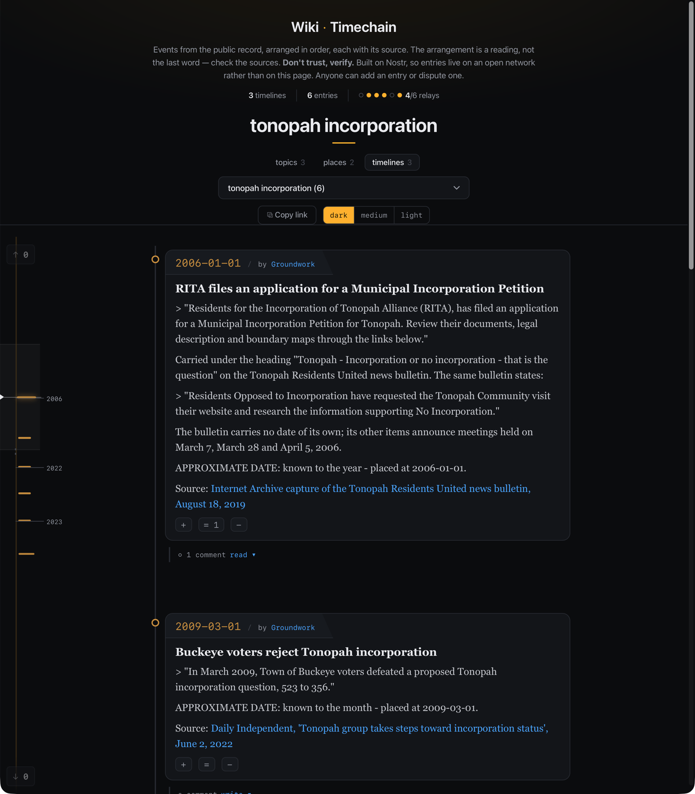

# Wiki-Timechain

A live viewer of timeline events (nostr kind-30818 wiki cards). 
Reads straight from relays — no server, no login, no build step.
Any dated event with a source link fits naturally on the rail.

**Live:** https://lamekarjeggr.github.io/Wiki-Timechain/



## What it does

Timelines are discovered automatically, not hardcoded — the viewer pulls
30818 events from relays and groups any that carry a date and a collection
tag. Pick one from the picker and it shows up. Add a new card to a new
collection and it appears there too — no fixed list, no publish-side
registration.

## Navigating

The chips organize the same list of timelines three ways — by **topic**, by
**place**, or flat — and the dropdown below picks one. Whatever the grouping,
the spine always shows a single timeline, never a merge; under places each
timeline is filed once, at its most specific rung. Time runs down the page:
scroll is the time axis, and the whitespace between cards is proportional
to the real gap between events — long silences collapse to a `⋯ N years`
marker you can expand in place. A bold amber rule marks *now*; anything
below it is scheduled, not history. **⧉ Copy link** copies a shareable URL
to whatever timeline you're viewing — opening it drops the recipient
straight onto that collection.

## Documents that change

When a timeline follows a document through versions, a card can carry the
change rather than describe it. A card tags the version it revises with
[NIP-54](https://github.com/nostr-protocol/nips/blob/master/54.md)'s `fork`
marker and marks the text in djot — `{-removed-}`, `{+added+}`. A mark alone
on its own line renders as a **gutter row** (a rule and a `−`/`+`, the diff
idiom); a mark inside a sentence stays inline. Any card carrying both gets a
key and an **as passed / what changed** switch, whose state travels in the URL
so a link can open either view.

There is no new tag for this — the fork marker and the djot marks are both
already in the format. It works in any timeline. What it buys: a version card
in *as passed* reconstructs the clean document it was diffed from, so one card
holds both the text and its history. The
[convention](CONVENTION.md#revisions-and-diffs--showing-what-a-document-used-to-say)
covers the authoring rules, including the one that matters most — don't diff
more finely than a reader can follow.

## Reactions and comments

Cards carry reactions ([NIP-25](https://github.com/nostr-protocol/nips/blob/master/25.md)
kind-7) and comments ([NIP-22](https://github.com/nostr-protocol/nips/blob/master/22.md)
kind-1111), read live from the same relays and written from the page — signed
by a browser extension if you have one, otherwise by a keypair the page mints
for you on the spot. It never asks for an existing secret key.

Cards themselves are read-only forever: reactions and comments are the only
things this page ever writes. Try it on the live site; the behavior is the
documentation.

## The convention

A timeline entry is a single **kind-30818** wiki event
([NIP-54](https://github.com/nostr-protocol/nips/blob/master/54.md)) that labels
itself as belonging here ([NIP-32](https://github.com/nostr-protocol/nips/blob/master/32.md)):
the `wikitimechain` marker, a `wikitimechain.collection` label, and an
`event_date`. A collection *is* its slug — publish the first card carrying a new
one and that timeline exists, with no registration step.

Same `d` from the **same** author edits the card; same `d` from a **different**
author renders beside it — a dispute, never an overwrite.

**The tag scheme lives in one place: [CONVENTION.md](CONVENTION.md).** Don't copy
it into other docs — copies go stale, and a stale copy tells a contributor to
publish a card the viewer can't see.

## Deploy

```
git push origin main
```
GitHub Pages redeploys in about a minute. This is only for changes to the
viewer itself — new cards need no deploy, they show up on next page load.

## Contributing a card

Publish a kind-30818 event with the tags above (get keys at nstart.me,
publish via wikifreedia or wikistr) — see the "Add to the record" section
on the live page for the exact tag shape.

## Built on

nostr NIPs this rests on:
- **[NIP-01](https://github.com/nostr-protocol/nips/blob/master/01.md)** —
  events, relays, and *addressable events* (the `d`-tag, replace-per-author
  behavior kind-30818 uses)
- **[NIP-54](https://github.com/nostr-protocol/nips/blob/master/54.md)** —
  Wiki: defines kind-30818 and the `title` / `d` / entry format
- **[NIP-19](https://github.com/nostr-protocol/nips/blob/master/19.md)** —
  bech32 entities; the viewer encodes `npub`s inline (zero-dep) for njump
  links, and `nsec` for the minted starter key
- **[NIP-25](https://github.com/nostr-protocol/nips/blob/master/25.md)** —
  reactions (the `+` tap, kind 7)
- **[NIP-22](https://github.com/nostr-protocol/nips/blob/master/22.md)** —
  comments (kind 1111, scoped to one signed version of a card)
- **[NIP-07](https://github.com/nostr-protocol/nips/blob/master/07.md)** —
  browser signer extensions; used when present, minting is the fallback
- **[BIP-340](https://github.com/bitcoin/bips/blob/master/bip-0340.mediawiki)** —
  schnorr signatures; the minted key's signer is implemented inline and
  verified against the official test vectors

Tools & references:
- Get keys — [nstart.me](https://nstart.me)
- Publish a card — [wikifreedia.xyz](https://wikifreedia.xyz) ·
  [wikistr.com](https://wikistr.com)
- Inspect any event or author — [njump.me](https://njump.me)
- Content format — [djot](https://djot.net)
- Relays queried — `relay.damus.io`, `nos.lol`, `relay.primal.net`,
  `relay.mostr.pub`, `relay.nostr.band`, `nostr.wine`

## Design constraints

- Cards are read-only forever: the page never writes or edits a 30818. The
  only writes are reactions and comments the visitor signs with their own
  key — and it never asks for a secret key
- Single file, zero dependencies
- Colorblind-safe (no meaning carried by hue alone)

## License

[CC0 1.0 Universal](LICENSE) — public domain dedication. Everything here, the viewer
and the convention both: copy it, fork it, ship it, no attribution required. The
convention text is deliberately under the same terms as the NIPs themselves, which are
public domain, so it can be lifted into one without friction.
